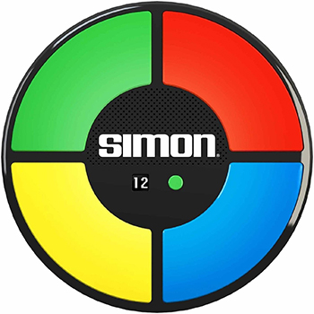

Simon Game
==========
A recreation of the classic memory game

This project is part of FreeCodeCamp's front end development certification.

##### [Project Description](https://www.freecodecamp.org/challenges/build-a-simon-game)

> Project should implement the following user stories:
> - User is presented with a random sequence of button presses.
>
> -  Each time user inputs a series of button presses correctly, user sees the same series of button presses but with an additional step.
> -  The user hears a sound that corresponds to each button both when the series of button presses plays, and when the user presses a button.
> -  If the user presses the wrong button, he/she is notified of the mistake, and the sequence of button presses is shown again.
> -  The user can see how many steps are in the current sequence of button presses.
> -  The user can restart the game at any time by pressing a button.
> -  The user can choose to play in strict mode. In this mode, if user presses an incorrect button they have to start over from th. When this happens the user will be notified.
> -  THe user can win the game by getting a sequence of 20 steps correct. User is notified that he/she has won the game, then the game starts over
